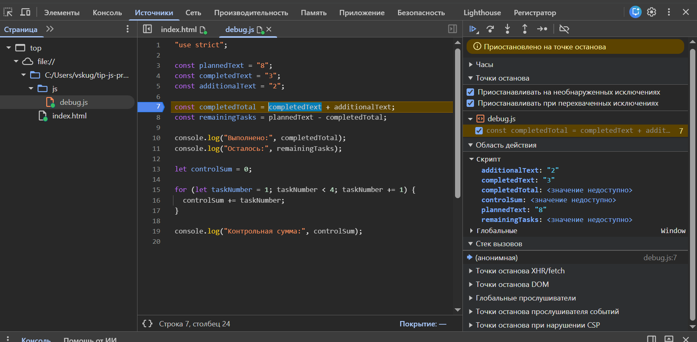

# Практическая работа №1

Манишин Савелий, группа ЭФБО-04-25.
Номер в журнале 22, значит вариант 6: ((22 - 1) % 8) + 1 = 6.
Данные варианта: totalTasks = 18, completedTasks = 6, dailyLimit = 5.

## Окружение

Работал на Windows 10 Pro (10.0.19045). Node.js v24.21.0, npm 11.19.0, Git 2.55.0.windows.3, браузер Chrome

Проверка версий:

```text
> node --version
v24.21.0

> npm.cmd --version
11.19.0

> git --version
git version 2.55.0.windows.3
```

Обычный `npm --version` в PowerShell не сработал из-за 10 винды, пришлось запускать `npm.cmd`.

## Как запускать

Из корня репозитория:

```bash
node practice-01/js/hello.js
node practice-01/js/types.js
node practice-01/js/progress.js
node practice-01/js/plan.js
node practice-01/js/debug.js
```

В браузере открываю practice-01/index.html, в теге script меняю путь на нужный файл, сохраняю, обновляю страницу и смотрю вкладку Console (F12).

## Задание 1

Запускал hello.js двумя способами. Через `node practice-01/js/hello.js` вывод появился в терминале. Через браузер — во вкладке Console, на самой странице никакого текста нет, потому что console.log в HTML ничего не добавляет.

Первые четыре строки совпадают, отличается последняя. В Node.js `typeof document` дал undefined, в браузере object. Получается, document это не часть языка JavaScript, его создаёт браузер для открытой страницы. В Node.js страницы нет, поэтому и переменной такой нет.

## Задание 2

| № | Выражение | Ожидание до запуска | Результат | Тип | Объяснение |
|---:|---|---|---|---|---|
| 1 | `"8" + 2` | 82 | 82 | string | плюс со строкой склеивает, 2 превращается в "2" |
| 2 | `"8" - 2` | 6 | 6 | number | минус работает только с числами, поэтому "8" стало числом |
| 3 | `Number("8") + 2` | 10 | 10 | number | сначала явно перевели строку в число, потом сложили |
| 4 | `"12" > "3"` | true | false | boolean | сравниваются две строки посимвольно, "1" меньше "3" |
| 5 | `12 === "12"` | false| false | boolean | строгое сравнение не приводит типы, а тут number и string |
| 6 | `Number("")` | 0 | 0 | number | пустая строка даёт 0, а не NaN, поэтому так проверять ввод нельзя |
| 7 | `Number("text")` | NaN | NaN | number | текст в число не переводится, но тип у NaN всё равно number |
| 8 | `Boolean("false")` | true | true | boolean | любая непустая строка это true, содержимое не важно |
| 9 | `typeof null` | object | "object" | string | старая особенность языка, на самом деле null не объект |
| 10 | `typeof NaN` | number | "number" | string | NaN считается числом, поэтому одного typeof для проверки мало |

## Задание 3

Сначала проверяю тип и целые ли числа, потом границы, потом отдельно случай, когда задач нет совсем, и только в конце считаю процент. Если считать раньше проверок, при нуле получится деление на ноль.

| Проверка | Данные | Ожидается | Фактически | Итог |
|---|---|---|---|---|
| Свой вариант | 18, 6 | осталось 12, 33.3%, В работе | осталось 12, 33.3%, В работе | Пройдено |
| Обычный случай | 12, 5 | осталось 7, 41.7%, В работе | осталось 7, 41.7%, В работе | Пройдено |
| Задач нет | 0, 0 | Задач пока нет | Задач пока нет | Пройдено |
| Ничего не сделано | 5, 0 | осталось 5, 0.0%, Не начато | осталось 5, 0.0%, Не начато | Пройдено |
| Всё сделано | 5, 5 | осталось 0, 100.0%, Завершено | осталось 0, 100.0%, Завершено | Пройдено |
| Выполнено больше, чем есть | 5, 6 | ошибка | Ошибка: выполнено больше задач, чем есть всего | Пройдено |
| Отрицательное число | -1, 0 | ошибка | Ошибка: количество задач не может быть отрицательным | Пройдено |
| Дробное число | 5, 2.5 | ошибка | Ошибка: количество задач должно быть целым числом | Пройдено |
| Строка вместо числа | "5", 2 | ошибка | Ошибка: количество задач должно быть целым числом | Пройдено |
| Больше 1000 | 1001, 0 | ошибка | Ошибка: задач не может быть больше 1000 | Пройдено |
| NaN | NaN, 0 | ошибка | Ошибка: количество задач должно быть целым числом | Пройдено |

## Задание 4

Проверки те же плюс дневная норма: она должна быть целой и от 1 до 1000, иначе цикл может не закончиться. Каждый день беру Math.min от нормы и остатка, поэтому в последний день выполняется только то, что реально осталось.

| Проверка | Данные | Ожидается | Фактически | Итог |
|---|---|---|---|---|
| Свой вариант | 18, 6, 5 | 3 дня, в последний 2 задачи | осталось 12, дни 5 / 5 / 2, дней 3 | Пройдено |
| Обычный случай | 12, 5, 3 | 3 дня, в последний 1 задача | осталось 7, дни 3 / 3 / 1, дней 3 | Пройдено |
| Делится ровно | 10, 4, 3 | 2 дня по 3 задачи | осталось 6, дни 3 / 3, дней 2 | Пройдено |
| Норма больше остатка | 5, 3, 10 | 1 день, 2 задачи | осталось 2, день 1: 2 задачи, дней 1 | Пройдено |
| Всё сделано | 5, 5, 2 | 0 дней | Все задачи уже выполнены, дней 0 | Пройдено |
| Задач нет | 0, 0, 2 | 0 дней | Все задачи уже выполнены, дней 0 | Пройдено |
| Норма 0 | 5, 2, 0 | ошибка | Ошибка: дневная норма должна быть от 1 до 1000 | Пройдено |
| Дробная норма | 5, 2, 1.5 | ошибка | Ошибка: дневная норма должна быть целым числом | Пройдено |
| Выполнено больше, чем есть | 5, 6, 2 | ошибка | Ошибка: выполнено больше задач, чем есть всего | Пройдено |
| Норма строкой | 5, 2, "2" | ошибка | Ошибка: дневная норма должна быть целым числом | Пройдено |
| Норма больше 1000 | 5, 2, 1001 | ошибка | Ошибка: дневная норма должна быть от 1 до 1000 | Пройдено |

## Задание 5

Исходная программа отработала без ошибок в консоли, но числа получились неправильные:

```text
Выполнено: 32
Осталось: -24
Контрольная сумма: 6
```

После исправления:

```text
Выполнено: 5
Осталось: 3
Контрольная сумма: 10
```

| Ошибка | Что было видно | Причина | Как исправил | Результат |
|---|---|---|---|---|
| Подсчёт выполненных задач | Выполнено 32, осталось -24 | completedText и additionalText это строки, поэтому плюс склеил их в "32", а минус потом превратил склейку в число | обернул обе строки в Number() перед сложением | Выполнено 5, осталось 3 |
| Граница цикла | Контрольная сумма 6 вместо 10 | в цикле стояло taskNumber < 4, поэтому четвёртая задача не попадала в сумму | заменил на taskNumber <= 4 | Контрольная сумма 10 |



## Вывод

Благодаря этой практике разобрался, чем язык отличается от среды выполнения, понял что JS молча преобразует типы, и из-за этого "8" + 2 даёт 82, узнал то проверять данные надо до расчётов, иначе ноль или строка ломают программу. Самой показательной оказалась ошибка в debug.js, ибо на ее фикс ушло больше всего времени